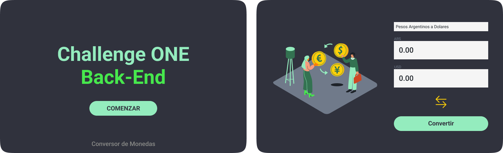

# Conversor de Monedas con Java ☕ 

El objetivo de este challenge es crear un conversor de monedas. El programa debe poder convertir diferentes monedas a **ARS** y viceversa.

## 📝Descripción 

En esta oportunidad se nos solicitó crear un conversor de divisas utilizando el lenguaje **Java**. Las características solicitadas por nuestro cliente son las siguientes:

* Convertir pesos a **Dólares estadounidenses**
* Convertir pesos a **Euros**
* Convertir pesos a **Libras Esterlinas**
* Convertir pesos a **Yen Japonés**
* Convertir pesos a **Won sul-coreano**

## 🖥️ Tecnologías Utilizadas:

- Java
- Netbeans
- Java Swing

## ⬇️ Download

1. Haz el fork del proyecto. En la parte superior derecha, al hacer clic en el icono se creará un repositorio del proyecto en tu cuenta personal de GitHub.

2. Una vez que tengas el repositorio **"forkeado"** en tu cuenta, comprueba si la URL de la página es la del repositorio de tu cuenta.

3. Haz clic en la opción Code. Se mostrarán varias formas de instalar el repositorio en su máquina.

Una opción es descargar el código en un paquete "`ZIP`" y extraer la carpeta a tu computadora.

---

Si deseas contribuir a este proyecto, no dudes en enviar un pull request o abrir un issue en GitHub.